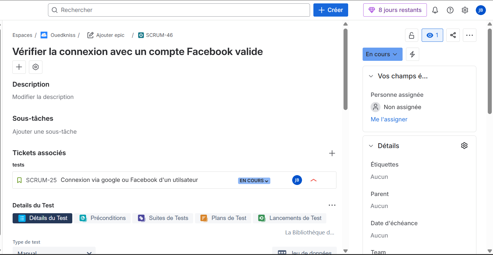
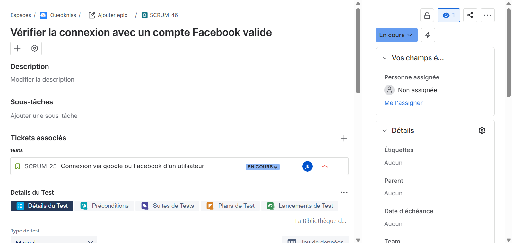

## Exécution du cas de test : Vérification de la connexion avec un compte Facebook valide 
Ce document présente l’exécution d’un cas de test réalisée via **Xray** dans **Jira**.  
Le test a été exécuté avec succès et son statut est **OK (Passed)**.

Vous trouverez ci-dessous une vidéo illustrant le déroulement complet de l’exécution du test ainsi que la validation du résultat dans Jira.
Cliquer sur l'image pour lancer la vidéo

---
## Exécution du cas de test : Vérification de la connexion avec un compte Google valide 
Ce document présente l’exécution d’un cas de test réalisée via **Xray** dans **Jira**.  
Le test a été exécuté avec succès et son statut est **OK (Passed)**.

Vous trouverez ci-dessous une vidéo illustrant le déroulement complet de l’exécution du test ainsi que la validation du résultat dans Jira.
Cliquer sur l'image pour lancer la vidéo

